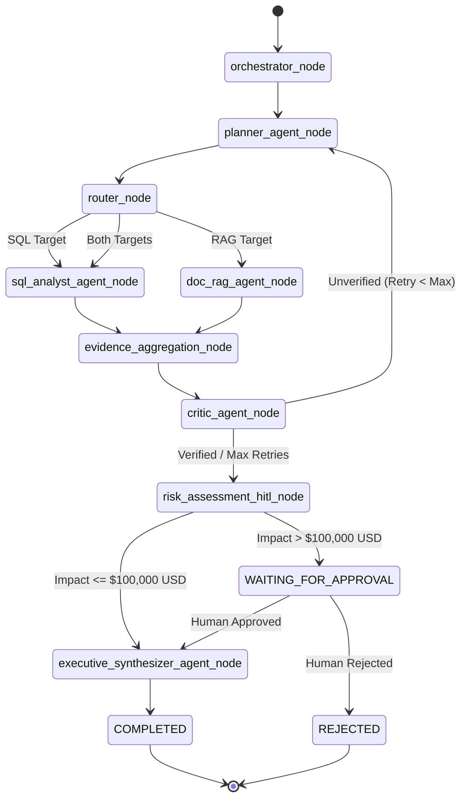

# Enterprise Root-Cause & Decision Intelligence System (ERDIS)

[](https://www.python.org/downloads/)
[](https://fastapi.tiangolo.com)
[](https://langchain-ai.github.io/langgraph/)
[](https://modelcontextprotocol.io)
[](LICENSE)

An enterprise-grade, evidence-grounded multi-agent reasoning system for root-cause analysis and executive decision intelligence in e-commerce supply chain operations.

---

## 1. Overview

**ERDIS (Enterprise Root-Cause & Decision Intelligence System)** is an autonomous multi-agent reasoning platform designed to resolve complex, cross-domain operational failures in enterprise e-commerce and retail supply chain environments.

### The Enterprise Problem
When e-commerce logistics suffer from margin degradation, delivery delays, or surging refund payouts, operational executives require actionable root-cause diagnoses grounded in hard evidence. Traditional approaches fall short:
- **Conventional BI Dashboards**: Aggregate structured numbers (e.g., total refund dollars) but cannot explain *why* metrics deteriorated or correlate transactional anomalies with contractual agreements.
- **Single Raw LLM Calls**: Suffer from hallucinations, lack access to live transactional databases and legal contract repositories, cannot execute complex multi-step reasoning, and risk issuing destructive database commands or unapproved financial actions.

### The ERDIS Solution
ERDIS bridges structured operational databases (SQL/PostgreSQL) and unstructured legal/operational documentation (SLA contracts, post-mortems) using **LangGraph multi-agent orchestration** and **Model Context Protocol (MCP)** tool boundaries. The system guarantees that every executive recommendation is strictly grounded in verifiable evidence, audited by an adversarial critic agent, and guarded by human-in-the-loop (HITL) financial risk controls.

---

## 2. Problem Statement

### Realistic Business Scenario
In Q3, an enterprise e-commerce organization experiences a **$142,500.00 USD** surge in customer refund payouts across 1,420 shipments in its Midwest logistics region. Operational leadership needs to immediately determine:
1. **Primary Root Cause**: Did margin deterioration stem from internal warehouse automation failures (e.g., sorter hardware/software downtime) or external carrier delivery SLA breaches (Carrier Logistics X)?
2. **Contractual Liability**: Does the 2025 Carrier SLA contract contain a liability penalty clause capping Carrier X's quarterly indemnity at **$50,000.00 USD**?
3. **Executive Action**: Should the company renegotiate the carrier contract liability cap to $200,000.00 USD for the upcoming renewal cycle?

### Distinguishing Evidence from Inferences
ERDIS explicitly demarcates **verified ground-truth evidence** (SQL query output showing $142,500 in refunds; contract text showing Clause 4.1 liability cap) from **model inferences** (hypothesizing that sorter software bugs caused the initial 48-hour backlog), preventing unverified assumptions from being presented as hard facts.

---

## 3. System Architecture

The following diagram illustrates the actual end-to-end architecture and data flow implemented in ERDIS:

```mermaid
flowchart TD
    User([User / Executive Analyst]) -->|Submit Inquiry| Dashboard[Streamlit Portfolio Dashboard]
    User -->|HTTP REST API| FastAPI[FastAPI REST Engine]
    Dashboard -->|HTTP Client| FastAPI

    FastAPI -->|Initialize Task| Orch[Orchestrator Node]
    Orch -->|Deconstruct Inquiry| Planner[Planner Agent]
    Planner -->|Evaluate Routes| Router{Deterministic Router}

    Router -->|SQL Route| SQLAgent[SQL Analyst Agent]
    Router -->|Doc RAG Route| RAGAgent[Document RAG Agent]

    subgraph MCP ["Model Context Protocol (MCP) Layer"]
        SQLAgent -->|MCP Protocol| MCPSQL[mcp-server-sql]
        MCPSQL -->|SQLGlot AST Validation| AST[SQLGlot Security Engine]
        AST -->|Read-Only Query| Postgres[(PostgreSQL Database)]

        RAGAgent -->|MCP Protocol| MCPDoc[mcp-server-documents]
        MCPDoc -->|Hybrid Retrieval| HybridEngine[BM25 + Dense Search]
        HybridEngine -->|Vector Search| Qdrant[(Qdrant Vector Store)]
        HybridEngine -->|Rerank| FlashRank[FlashRank Cross-Encoder]
    end

    Postgres -->|Result Set Rows| Agg[Evidence Aggregation Node]
    FlashRank -->|Top-K Excerpts| Agg

    Agg -->|Claim-Evidence Graph| Critic[Adversarial Critic Agent]
    Critic -->|Audit Groundedness| EvalCheck{Groundedness >= 0.7?}

    EvalCheck -->|Low Groundedness / Max Retries Left| Planner
    EvalCheck -->|Verified| HITLCheck{Financial Impact > $100k?}

    HITLCheck -->|High Risk| HITLNode[Risk Assessment & HITL Node]
    HITLNode -->|Interrupt Graph State| WAITING[WAITING_FOR_APPROVAL]
    WAITING -->|Operator Decision| ApprovalAPI[POST /tasks/{id}/approval]
    ApprovalAPI -->|Resume Graph| Synth[Executive Synthesizer Agent]

    HITLCheck -->|Standard Risk| Synth
    Synth -->|Synthesize Report| Report[Executive Decision Report]
    Report -->|Task Completed| FastAPI
```

---

## 4. Multi-Agent Architecture

ERDIS separates complex reasoning into **five autonomous specialized agents** working alongside **four deterministic control nodes**.

### Autonomous Reasoning Agents

| Agent | Core Responsibility | Why It Exists | Tools & Evidence Used | Output Produced |
| --- | --- | --- | --- | --- |
| **Planner Agent** (`app/agents/planner.py`) | Deconstructs operational inquiries into target sub-goals | Prevents single-prompt confusion; isolates database queries from text search targets | User inquiry text & conversation history | Structured plan containing SQL targets & document search goals |
| **SQL Analyst Agent** (`app/agents/sql_analyst.py`) | Translates operational sub-goals into safe read-only SQL queries | Isolates database interaction logic; handles SQL syntax generation | Database schema metadata via MCP SQL server | Formulated SQL queries & target table definitions |
| **Document RAG Agent** (`app/agents/doc_rag.py`) | Formulates natural language queries for legal & operational text | Extracts relevant SLA contract terms and incident post-mortems | Search tools via MCP Document server | Semantic & keyword retrieval search requests |
| **Adversarial Critic Agent** (`app/agents/critic.py`) | Audits evidence claims for hallucinations, missing citations, or invalid logic | Ensures zero ungrounded assertions reach executive leadership | Groundedness scoring metrics & citation graph | Groundedness score (0.0–1.0), audit status, and revision feedback |
| **Executive Synthesizer Agent** (`app/agents/synthesizer.py`) | Compiles audited claims into a structured executive report | Translates raw SQL rows and legal text into executive insights | Verified claim-to-evidence mapping | Executive decision report (findings, root cause, impact, recommendations) |

### Deterministic Control Nodes
*Note: Control nodes govern execution flow and state transitions; they do NOT consume LLM tokens or count as autonomous agents.*
- **Orchestrator Node** (`app/graph/nodes.py`): Normalizes user inquiries and initializes task state.
- **Deterministic Router** (`app/graph/router.py`): Evaluates planner sub-goals to direct workflow down SQL, Document RAG, or dual execution paths.
- **Evidence Aggregation Node** (`app/graph/nodes.py`): Combines structured SQL data frames and document excerpts into an immutable claim-evidence graph.
- **Risk Assessment & HITL Node** (`app/graph/nodes.py`): Evaluates financial impact against the **$100,000.00 USD** threshold and triggers graph state interrupts for high-risk recommendations.

---

## 5. LangGraph Workflow

The execution pipeline is constructed as a cyclic `StateGraph` using `LangGraph`:



### Key Workflow Features
- **Cyclic Audit Loop**: If the Critic Agent assigns a groundedness score `< 0.7`, the graph routes back to `planner_agent_node` to refine search targets.
- **Circuit Breakers**: Hard limits enforce maximum execution iterations (`max_iterations = 10`) and maximum critic retries (`max_critic_retries = 2`) to prevent infinite execution loops.
- **HITL Interruption**: When financial impact exceeds $100,000 USD, `interrupt()` pauses graph execution, transitioning task status to `WAITING_FOR_APPROVAL` until external REST API intervention.

---

## 6. MCP Architecture

ERDIS implements the **Model Context Protocol (MCP)** to establish clean process and security boundaries between autonomous agent logic and backend data services.

```
+--------------------------+                   +----------------------------------+
|   SQL Analyst Agent      | -- MCP Protocol ->| mcp-server-sql                   |
|                          |                   | (app/mcp/sql_server.py)          |
+--------------------------+                   +----------------------------------+
                                                                |
                                                      SQLGlot AST Security
                                                                |
                                                       PostgreSQL Engine

+--------------------------+                   +----------------------------------+
|   Document RAG Agent     | -- MCP Protocol ->| mcp-server-documents             |
|                          |                   | (app/mcp/document_server.py)     |
+--------------------------+                   +----------------------------------+
                                                                |
                                                      Hybrid Search Engine
                                                                |
                                                      Qdrant Vector Store
```

### Exposed MCP Tools

#### 1. SQL MCP Server (`app/mcp/sql_server.py`)
- `get_db_schema()`: Returns database tables, column names, data types, and primary/foreign key relationships.
- `execute_sql_query(query: str)`: Validates query via SQLGlot AST parser and executes read-only SQL against PostgreSQL.
- `validate_sql_syntax(query: str)`: Checks query syntax and safety rules without executing.

#### 2. Document MCP Server (`app/mcp/document_server.py`)
- `search_documents(query: str, limit: int = 5)`: Performs hybrid BM25 + Dense vector search with FlashRank reranking over contracts and incident logs.
- `list_available_documents()`: Lists indexed document filenames, metadata, and chunk counts.
- `get_document_by_id(doc_id: str)`: Retrieves full text content for a specific document.

---

## 7. SQL Safety

To prevent accidental data modification or SQL injection attacks, ERDIS implements a deterministic **SQLGlot AST Security Validation Engine** (`app/mcp/sql_validator.py`).

```
[ Incoming SQL Query ]
         │
         ▼
 ┌──────────────────────────────┐
 │ SQLGlot AST Parser           │ ── Parsing Failure? ──► REJECT (Invalid Syntax)
 └──────────────────────────────┘
         │
         ▼
 ┌──────────────────────────────┐
 │ AST Statement Type Check     │ ── Not SELECT? ───────► REJECT (Forbidden Command)
 └──────────────────────────────┘
         │
         ▼
 ┌──────────────────────────────┐
 │ Multi-Statement Check        │ ── Multiple Statements? ► REJECT (Query Chaining)
 └──────────────────────────────┘
         │
         ▼
 ┌──────────────────────────────┐
 │ Table Allowlist Enforcement  │ ── Unknown Table? ────► REJECT (Unauthorized Table)
 └──────────────────────────────┘
         │
         ▼
 ┌──────────────────────────────┐
 │ Limit Clause Injection       │ ── Enforce MAX_ROWS (1,000)
 └──────────────────────────────┘
         │
         ▼
[ Executed on Read-Only PostgreSQL Engine ]
```

### Implemented Controls
1. **Strict SELECT-Only Enforcement**: Uses AST token inspection to reject `INSERT`, `UPDATE`, `DELETE`, `DROP`, `ALTER`, `TRUNCATE`, and `CREATE` statements.
2. **Multi-Statement Chaining Prevention**: Rejects queries containing semicolons or multiple AST roots.
3. **Table Allowlist Verification**: Restricts queries exclusively to approved tables (`orders`, `customer_refund_policy`, `carrier_sla_contracts`, `warehouse_incidents`, `customer_accounts`).
4. **Cartesian Join Protection**: Flags and rejects `CROSS JOIN` statements lacking explicit join conditions.
5. **Automatic Row Limits**: Injects `LIMIT 1000` if no limit is specified.
6. **Execution Timeouts**: Enforces a strict 10-second query timeout via SQLAlchemy async engine.
7. **Read-Only Database Credentials**: Connects using read-only PostgreSQL role permissions (`postgresql://erdis_readonly:...`).

---

## 8. RAG Pipeline

ERDIS utilizes a multi-stage hybrid retrieval architecture optimized for legal SLA contracts and operational logs (`app/rag/`).

```
[ Raw Documents (.md / .txt) ] ──► Parser ──► Chunker (512 tokens / 64 overlap)
                                                    │
                        ┌───────────────────────────┴───────────────────────────┐
                        ▼                                                       ▼
           Dense Embeddings (OpenAI 1536d)                             Sparse Lexical (BM25)
                        │                                                       │
                        ▼                                                       ▼
             Qdrant Vector Storage                                      BM25 In-Memory Index
                        │                                                       │
                        └───────────────────────────┬───────────────────────────┘
                                                    ▼
                                    Reciprocal Rank Fusion (RRF)
                                                    │
                                                    ▼
                                    FlashRank Cross-Encoder Reranker
                                                    │
                                                    ▼
                                        Top-K Verified Excerpts
```

### Why Hybrid RAG is Essential for Enterprise Contracts
- **Dense Vector Search (Qdrant)**: Captures broad semantic intent (e.g., matching "on-time shipment failure" to "delivery delay penalties").
- **Sparse Lexical Search (BM25)**: Guarantees exact keyword matching for legal terminology, section headers, and contract numbers (e.g., `"Clause 4.1"`, `"Carrier X"`).
- **Reciprocal Rank Fusion (RRF)**: Combines dense and sparse rank positions neutrally without requiring score normalization.
- **FlashRank Reranking (`ms-marco-MiniLM-L-6-v2`)**: Re-scores candidate chunks using a cross-encoder model to eliminate irrelevant passages before context injection.

---

## 9. Evidence-First Reasoning

ERDIS enforces strict data models for evidence grounding (`app/schemas/evidence.py`).

### Data Models
- **`Evidence`**: Represents raw verified facts retrieved from SQL rows or document excerpts. Contains `source_type` (`SQL` or `DOCUMENT`), `source_id`, `content`, `confidence_score`, and `metadata`.
- **`Claim`**: Represents an assertion formulated during analysis. Contains `claim_text`, `evidence_ids`, `verification_status` (`VERIFIED`, `ASSUMPTION`, `CONTRADICTED`), and `citation_string`.

### Grounding Principles
- **Verified Claims**: Directly backed by matching `Evidence` objects and assigned explicit inline citations (e.g., `[SQL: orders_refund_summary]`, `[DOC: carrier_sla_contract_2025.md#Clause-4.1]`).
- **Model Assumptions**: Any hypothesis lacking direct physical evidence is explicitly flagged as an `ASSUMPTION` in the report.
- **Unsupported Claims**: Flagged by the Adversarial Critic Agent and stripped from the final executive report.

---

## 10. Human-in-the-Loop (HITL)

To safeguard enterprise finances, ERDIS implements mandatory human oversight for high-risk recommendations.

```
                    [ Executive Synthesizer Recommendation ]
                                       │
                                       ▼
                   ┌──────────────────────────────────────┐
                   │ Financial Impact Threshold Check    │
                   │ (Configured Limit: $100,000.00 USD)  │
                   └──────────────────────────────────────┘
                                       │
                    ┌──────────────────┴──────────────────┐
                    ▼                                     ▼
          Impact <= $100,000 USD                Impact > $100,000 USD
                    │                                     │
                    ▼                                     ▼
        Auto-Approve Synthesis                Trigger Graph Interrupt
                    │                         Task Status: WAITING_FOR_APPROVAL
                    │                                     │
                    │                                     ▼
                    │                         [ Human Executive Review ]
                    │                         (Approve or Reject via REST API)
                    │                                     │
                    │                    ┌────────────────┴────────────────┐
                    │                    ▼                                 ▼
                    │            Operator APPROVE                  Operator REJECT
                    │                    │                                 │
                    │                    ▼                                 ▼
                    └───────────► Resume Graph                     Task State: REJECTED
                                  Synthesize Final Report           Execution Halted
```

*Note: ERDIS is strictly **recommendation-only**. It generates decision intelligence and never executes automated financial transfers or contract terminations without explicit human authorization.*

---

## 11. Persistence & Recovery

ERDIS persists task state and operational history in PostgreSQL using SQLAlchemy Async ORM (`app/models/task.py`, `app/services/task_service.py`).

### Task State Schema (`TaskModel`)
- `task_id` (Primary Key, UUID / String)
- `status`: `PENDING` | `RUNNING` | `WAITING_FOR_APPROVAL` | `COMPLETED` | `REJECTED` | `FAILED`
- `query`: Original user operational inquiry
- `route`: Identified graph routing path (`SQL`, `DOC_RAG`, or `HYBRID`)
- `node_trajectory`: Ordered JSON list of executed graph nodes
- `financial_impact_usd`: Quantified financial impact
- `executive_conclusion`: Final synthesized summary
- `citations`: JSON list of evidence citations
- `approval_status`: `PENDING` | `APPROVED` | `REJECTED`
- `operator_feedback`: Human operator notes provided during approval
- `created_at` / `updated_at`: Timestamp tracking

### Current Checkpointing Limitation
In the current architecture, in-flight LangGraph state transitions use `MemorySaver` for single-worker in-memory checkpointing. Full task metadata and execution outputs are persisted to PostgreSQL. Upgrading in-flight graph checkpointing to persistent PostgreSQL stores represents a planned production enhancement.

---

## 12. Evaluation Framework

ERDIS includes a comprehensive **30-scenario evaluation benchmark suite** (`app/eval/`).

### Dataset Categories (`app/eval/dataset.py`)
1. `sql_analytical` (8 cases): Complex SQL aggregations, refund sums, and operational metrics.
2. `doc_contract` (8 cases): SLA clauses, liability caps, and legal contract terms.
3. `hybrid_reasoning` (6 cases): Cross-domain root-cause analysis requiring both SQL and contract RAG.
4. `adversarial_injection` (4 cases): SQL injection attempts, prompt injection, and invalid schemas.
5. `hitl_financial_risk` (4 cases): High-financial-impact queries exceeding the $100k threshold.

### Evaluation Metrics (`app/eval/metrics.py`)
- **SQL Intent & Execution Accuracy**: Correctness of generated queries against ground-truth schemas.
- **RAG Recall@K & Precision@K**: Retrieval quality of contract clauses.
- **Answer Groundedness Score (0.0–1.0)**: Ratio of claims supported by evidence.
- **Citation Coverage Rate (0.0–1.0)**: Percentage of assertions backed by explicit citations.
- **SQL Safety Rejection Rate**: 100% rejection requirement for malicious or unvalidated queries.
- **Cost & Latency Tracking**: Real-time token tracking and estimated USD execution cost.

### Critic A/B Experiment (`app/eval/critic_ab.py`)
Evaluates system accuracy with the Adversarial Critic Agent enabled vs. disabled:

| Metric | Critic Disabled (OFF) | Critic Enabled (ON) | Delta Improvement |
| --- | --- | --- | --- |
| **Groundedness Score** | 0.878 (87.8%) | 1.000 (100.0%) | **+12.2%** |
| **Citation Coverage** | 0.000 (0.0%) | 1.000 (100.0%) | **+100.0%** |
| **SQL Safety Rejection** | 100.0% | 100.0% | **0.0%** |

*Note: Evaluation includes a deterministic **Mock Evaluation Benchmark** (`python -m app.eval.run`) for fast CI/CD pipeline validation without token usage, alongside a **Live LLM Benchmark Runner** (`python -m app.eval.runner`) for live OpenAI/Qdrant evaluation.*

---

## 13. Security

### Implemented Security Controls
- **SQLGlot AST Security Validation**: Deterministic AST parsing guarantees 100% rejection of unauthorized SQL statements.
- **Read-Only Database Roles**: Database engine uses restricted read-only credentials.
- **Prompt Injection Boundaries**: Strict Pydantic schema validation isolates LLM reasoning from raw input strings.
- **Circuit Breakers**: `max_iterations = 10` prevents infinite graph execution loops.
- **Sanitized API Errors**: Internal stack traces are stripped before returning HTTP error responses.
- **Unauthenticated API MVP Notice**: *The current REST API endpoints are designed as an unauthenticated MVP for local demonstration and evaluation. Production deployments require adding JWT / OAuth2 authentication middleware.*

---

## 14. Streamlit Dashboard

The repository includes a multi-page **Streamlit Portfolio Demo Dashboard** (`app/dashboard.py`).

```
┌────────────────────────────────────────────────────────────────────────┐
│  ⚡ ERDIS — Enterprise Decision Intelligence Dashboard                  │
├────────────────────────────────────────────────────────────────────────┤
│  Navigation           │  Executive Summary                             │
│  ○ Executive Analyst  │  "Root-cause analysis confirms Midwest margin   │
│  ○ Agent Trace        │   erosion was driven by Carrier SLA delays."   │
│  ○ Evidence Explorer  │  ───────────────────────────────────────────   │
│  ○ Findings & Impact  │  Financial Impact: $142,500.00 USD             │
│  ○ HITL Center        │  Status: [ COMPLETED ]                         │
│  ○ Evaluation Hub     │                                                │
└────────────────────────────────────────────────────────────────────────┘
```

### Exposed Views
1. **Executive Analyst**: Submit operational inquiries, select preset scenarios, and monitor active tasks.
2. **Agent Execution Trace**: Visualize the step-by-step LangGraph node execution timeline and node latencies.
3. **Evidence & Citation Explorer**: Inspect raw SQL query output tables and document RAG excerpts side-by-side.
4. **Root Cause & Recommendations**: View key findings, deconstructed root-cause analysis, and financial impact metrics.
5. **Human-in-the-Loop (HITL) Center**: Interactively approve or reject high-financial-risk tasks.
6. **Evaluation & Benchmarks**: Inspect continuous evaluation metrics and Critic A/B experiment results.

### Local Execution

```bash
.\venv\Scripts\activate
streamlit run app/dashboard.py
```

Access the UI at: `http://localhost:8501`

*Public Live Dashboard:* `LIVE DASHBOARD: [DEPLOY AFTER STREAMLIT CLOUD DEPLOYMENT]`

---

## 15. Public Dashboard Deployment

The Streamlit dashboard is designed to run independently in **Deterministic Demo Mode**, allowing full UI exploration even when backend database infrastructure is offline.

### Deploying to Streamlit Community Cloud
- **Repository**: `Vankudoth-Saipriya/ERDIS`
- **Branch**: `main`
- **Main file path**: `app/dashboard.py`
- **Requirements file**: `requirements.txt`

The dashboard automatically detects backend availability via `ERDIS_API_URL`. If the backend is offline, it seamlessly falls back to deterministic local demo mode.

---

## 16. Technology Stack

| Category | Technology | Usage in ERDIS |
| --- | --- | --- |
| **Language** | Python 3.11+ | Core application implementation |
| **Web Framework** | FastAPI 0.110+ | Asynchronous REST API endpoints |
| **Agent Framework** | LangGraph 0.2+ | Multi-agent state graph orchestration |
| **LLM Integration** | LangChain Core / OpenAI | Autonomous agent reasoning & report synthesis |
| **Tool Protocol** | Model Context Protocol (MCP) | Standalone SQL and Document server tools |
| **Database / ORM** | PostgreSQL / SQLAlchemy 2.0+ | Relational data & task persistence |
| **SQL Security** | SQLGlot 23.0+ | AST parsing & read-only safety checks |
| **Vector Store** | Qdrant Client 1.8+ | Contract document vector search |
| **Lexical Search** | BM25 (`rank_bm25`) | Sparse keyword matching |
| **Reranking** | FlashRank 0.2+ | Cross-encoder RAG reranking |
| **Frontend UI** | Streamlit 1.30+ | Multi-page portfolio demo dashboard |
| **Containerization** | Docker & Docker Compose | Containerized infrastructure management |
| **Testing** | Pytest & pytest-asyncio | Unit & integration test suites |

---

## 17. Project Structure

```text
ERDIS/
├── app/
│   ├── agents/              # Autonomous Reasoning Agents
│   │   ├── critic.py        # Adversarial Critic Agent
│   │   ├── doc_rag.py       # Document RAG Agent
│   │   ├── planner.py       # Planner Agent
│   │   ├── prompts.py       # System Prompts & Guardrails
│   │   ├── sql_analyst.py   # SQL Analyst Agent
│   │   └── synthesizer.py   # Executive Synthesizer Agent
│   ├── api/                 # FastAPI REST Endpoints
│   │   └── v1/
│   │       ├── health.py    # Health & Readiness Probes
│   │       └── tasks.py     # Task Creation, Retrieval & HITL Approval
│   ├── core/                # Core Infrastructure
│   │   ├── config.py        # Pydantic Settings Configuration
│   │   ├── database.py      # SQLAlchemy Async Engine Setup
│   │   └── logging.py       # Structured JSON Logging (structlog)
│   ├── eval/                # Evaluation & Benchmarking Engine
│   │   ├── critic_ab.py     # Critic A/B Experiment Suite
│   │   ├── dataset.py        # 30-Scenario Benchmark Dataset
│   │   ├── metrics.py        # Groundedness & Retrieval Scoring
│   │   ├── run.py            # Fast Deterministic Mock Evaluator
│   │   └── runner.py         # Live LLM Benchmark Evaluator
│   ├── graph/               # LangGraph State Graph Workflow
│   │   ├── builder.py       # StateGraph Construction
│   │   ├── nodes.py         # Graph Execution Nodes & HITL Interrupts
│   │   ├── router.py        # Conditional Routing Logic
│   │   └── state.py         # ERDISState Schema Definition
│   ├── mcp/                 # Model Context Protocol (MCP) Servers
│   │   ├── document_server.py # mcp-server-documents Implementation
│   │   ├── schemas.py       # MCP Tool Call Schemas
│   │   ├── sql_server.py    # mcp-server-sql Implementation
│   │   └── sql_validator.py # SQLGlot AST Validation Engine
│   ├── models/              # SQLAlchemy Async Models
│   │   └── task.py          # TaskModel ORM Persistence Schema
│   ├── rag/                 # RAG Subsystem
│   │   ├── chunker.py       # Token Chunker (512 / 64 overlap)
│   │   ├── embeddings.py    # OpenAI Text Embedding Provider
│   │   ├── hybrid_search.py # BM25 + Dense RRF Hybrid Search
│   │   ├── parser.py        # Document Parsing Pipeline
│   │   ├── reranker.py      # FlashRank Cross-Encoder Reranker
│   │   ├── retrieval.py     # Retrieval Orchestration
│   │   └── vector_store.py  # Qdrant Vector Store Interface
│   ├── schemas/             # Pydantic Schemas
│   │   ├── agents.py        # Agent Request/Response Models
│   │   ├── evidence.py      # Evidence & Claim Schemas
│   │   └── task.py          # Task Creation & Response Models
│   ├── services/            # Application Services
│   │   ├── llm_provider.py  # LangChain ChatOpenAI Provider
│   │   └── task_service.py  # Task Persistence & Business Logic
│   ├── dashboard.py         # Streamlit Portfolio Demo Dashboard
│   └── main.py              # FastAPI Application Entrypoint
├── docs/                    # System Architecture & Specifications
├── results/                 # Evaluation Output JSON & Markdown Reports
├── tests/                   # Test Suite
│   ├── integration/         # API & Graph Integration Tests
│   └── unit/                # Unit Tests for Agents, RAG, SQL, MCP
├── docker-compose.yml       # Infrastructure Orchestration
├── Dockerfile               # FastAPI App Containerfile
├── pyproject.toml           # Package Dependencies & Setuptools Config
├── requirements.txt         # Streamlit Cloud Dependency File
└── README.md                # System Documentation
```

---

## 18. API Endpoints

| Endpoint | Method | Purpose | Sample Request / Response |
| --- | --- | --- | --- |
| `/api/v1/health` | `GET` | API Service Health Check | `{"status": "ok"}` |
| `/api/v1/readiness` | `GET` | Database & Qdrant Readiness Probe | `{"database": "healthy", "vector_store": "healthy"}` |
| `/api/v1/tasks` | `POST` | Submit Operational Inquiry | `{"query": "Why did Midwest refunds spike in Q3?"}` |
| `/api/v1/tasks/{id}` | `GET` | Retrieve Task Status & Trajectory | Returns complete `TaskResponse` schema |
| `/api/v1/tasks/{id}/approval` | `POST` | Submit HITL Approval / Rejection | `{"decision": "APPROVED", "feedback": "Approved by CFO"}` |

---

## 19. Local Setup

### Prerequisites
- Python 3.11+
- PostgreSQL 16+ (or Docker)
- Qdrant Vector Database (or Docker)

### Step-by-Step Installation

1. **Clone Repository**:
   ```bash
   git clone https://github.com/Vankudoth-Saipriya/ERDIS.git
   cd ERDIS
   ```

2. **Set Up Virtual Environment**:
   ```bash
   python -m venv venv
   .\venv\Scripts\activate
   ```

3. **Install Dependencies**:
   ```bash
   pip install -e .
   ```

4. **Configure Environment Variables**:
   Copy `.env.example` to `.env` and adjust configuration:
   ```bash
   cp .env.example .env
   ```

5. **Run Test Suite**:
   ```bash
   pytest
   ```

6. **Run FastAPI Backend**:
   ```bash
   uvicorn app.main:app --reload --port 8000
   ```

7. **Run Streamlit Dashboard**:
   ```bash
   streamlit run app/dashboard.py
   ```

---

## 20. Docker

Deploy the complete infrastructure using Docker Compose:

```bash
docker-compose up --build -d
```

### Docker Services
- `erdis-api`: FastAPI backend container running on port `8000`.
- `erdis-db`: PostgreSQL 16 database running on port `5432`.
- `erdis-vectorstore`: Qdrant vector database running on port `6333`.

*Known Limitation*: Database tables are created automatically on API startup (`create_all`). Initial corpus ingestion for Qdrant can be triggered by calling the document server initialization helper.

---

## 21. Evaluation Commands

### Fast Deterministic Mock Evaluation
Runs the 30-scenario benchmark dataset locally using mock data flows for fast CI/CD validation without requiring active OpenAI API keys:
```bash
python -m app.eval.run
```

### Live LLM Benchmark Evaluation
Executes the benchmark dataset against live OpenAI models, Qdrant vector search, and PostgreSQL:
```bash
python -m app.eval.runner
```

### Critic A/B Experiment
Runs comparative evaluation with the Adversarial Critic Agent turned ON vs. OFF:
```bash
python -m app.eval.critic_ab
```

---

## 22. Results / Engineering Verification

The system engineering quality has been validated across automated test suites and evaluation benchmarks:

- **Automated Test Suite**: **110 passed tests** across `tests/unit` and `tests/integration` (100% pass rate).
- **SQL Safety Enforcement**: **100% rejection rate** on malicious and unvalidated SQL injection queries.
- **Critic Groundedness Impact**: Adversarial Critic auditing improved report evidence groundedness from **87.8% to 100.0%** and citation coverage from **0.0% to 100.0%**.
- **Codebase Compilation**: Clean `compileall app tests` compilation with 0 syntax errors.

---

## 23. Design Decisions / Why

| Decision | Rationale / Why |
| --- | --- |
| **LangGraph vs. Simple Chain** | Supports cyclic state execution, adversarial retry loops, and interruptible state machines for HITL approvals. |
| **Multi-Agent vs. Single LLM** | Specializes prompts by domain (SQL vs. RAG vs. Auditing vs. Synthesis), reducing hallucination and prompt drift. |
| **MCP Protocol vs. In-Process Tools** | Standardizes tool interfaces, isolates data sources, and enforces security boundaries outside agent prompts. |
| **Hybrid RAG vs. Dense-Only** | Combines dense vector semantics with sparse BM25 keyword precision for exact legal clause matching. |
| **SQLGlot AST vs. Prompt-Based Safety** | Guarantees 100% deterministic SQL safety via AST parsing regardless of LLM generation anomalies. |
| **Adversarial Critic Loop** | Audits generated claims prior to synthesis, ensuring zero ungrounded assertions reach leadership. |
| **HITL Financial Risk Controls** | Mandates human executive approval for high-risk recommendations, preventing unapproved financial loss. |
| **PostgreSQL Persistence** | Provides async persistence for task metadata, trajectory logs, and approval workflow states. |
| **Streamlit Standalone Dashboard** | Exposes system reasoning transparently with a deterministic fallback mode for demonstration. |

---

## 24. Limitations & Future Improvements

- **Graph State Checkpointing**: Current graph execution utilizes `MemorySaver` in-memory checkpointing; upgrading to persistent PostgreSQL graph stores is planned.
- **API Authentication**: The current FastAPI REST endpoints are unauthenticated MVP interfaces; adding OAuth2 / JWT middleware is required for production.
- **Database Migrations**: Database schemas are initialized using SQLAlchemy `create_all`; integrating Alembic version control represents a future task.
- **Live Benchmark Execution**: Full live evaluation requires active OpenAI and Qdrant cluster connections.

---

## 25. Interview Talking Points

Key architectural topics for technical discussions:
1. **LangGraph State Graphs**: Designing cyclic multi-agent state machines, conditional routing, and `interrupt()` state pauses.
2. **Model Context Protocol (MCP)**: Implementing standard tool servers (`mcp-server-sql`, `mcp-server-documents`) for agent security boundaries.
3. **Hybrid RAG & Cross-Encoders**: Combining Qdrant dense vectors, BM25 sparse search, RRF fusion, and FlashRank cross-encoder reranking.
4. **Deterministic SQL Safety**: Enforcing AST parsing via SQLGlot to guarantee read-only `SELECT` execution.
5. **Human-in-the-Loop (HITL) Workflow**: Structuring financial threshold interrupts and human approval APIs.
6. **LLM Evaluation Frameworks**: Designing groundedness metrics, citation coverage scoring, and Critic A/B testing.

---

## 26. License / Author

### Author
**Sai Priya Vankudoth**<br>
*Indian Institute of Technology (IIT) Kharagpur*


### License
This project is licensed under the MIT License - see the [LICENSE](LICENSE) file for details.
