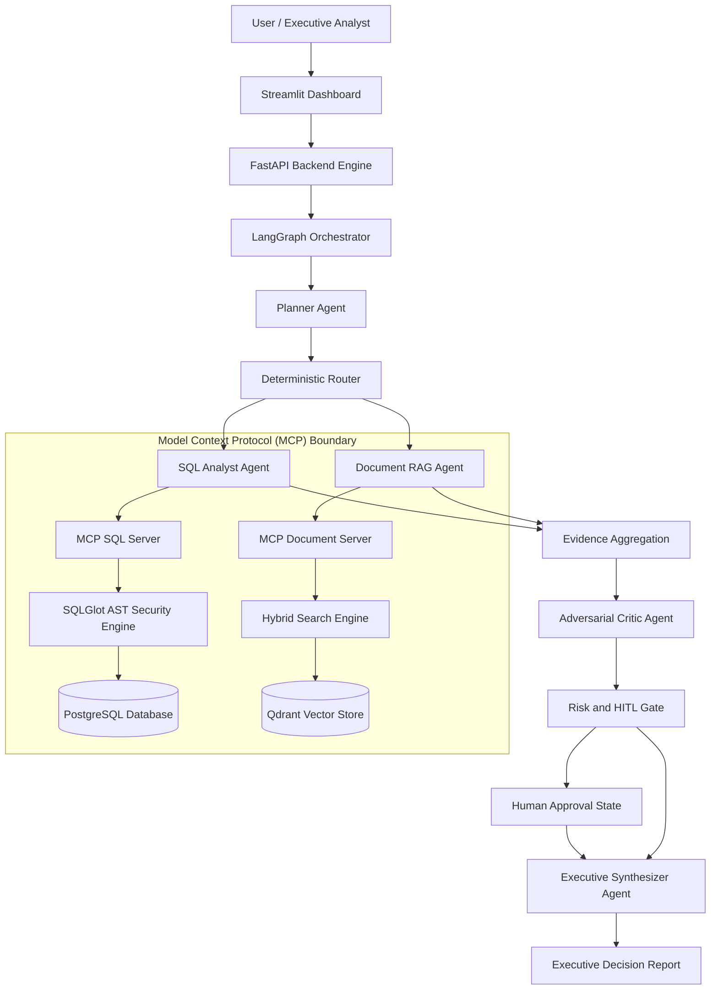
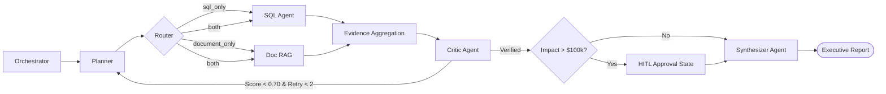

# ERDIS — Enterprise Root-Cause & Decision Intelligence System

[](https://www.python.org/downloads/)
[](https://fastapi.tiangolo.com)
[](https://langchain-ai.github.io/langgraph/)
[](https://modelcontextprotocol.io)
[](LICENSE)

An enterprise-grade, evidence-grounded multi-agent reasoning system for root-cause analysis and executive decision intelligence in supply chain operations.

---

## 1. Executive Overview

**ERDIS** is an autonomous multi-agent platform designed to diagnose complex operational failures across structured enterprise databases and unstructured legal contract repositories.

### The Problem
When e-commerce supply chains suffer from margin erosion or surging customer refund payouts:
- **Traditional BI Dashboards** show *what* metrics failed (e.g., $142,500 in refunds) but cannot explain *why* or cross-reference financial anomalies against legal SLA contracts.
- **Raw LLM Chatbots** hallucinate ungrounded explanations, lack secure database connections, and risk executing destructive write commands or unapproved financial actions.

### The ERDIS Solution
ERDIS bridges structured databases (PostgreSQL/SQLite) and legal documents (SLA contracts, postmortems) using **LangGraph multi-agent orchestration**, **Model Context Protocol (MCP)** tool boundaries, **SQLGlot AST security parsing**, and **hybrid dense-sparse RAG retrieval**.

Every recommendation is strictly grounded in verified database rows and contract text, audited by an adversarial critic agent, and guarded by human-in-the-loop (HITL) financial safety controls.

> **Resume Summary**: *Built ERDIS, an enterprise multi-agent decision intelligence system using LangGraph, MCP, SQLGlot AST validation, and hybrid RAG to automate evidence-grounded supply chain root-cause analysis with human-in-the-loop risk controls.*

---

## 2. Operational Scenario

An enterprise e-commerce organization experiences a **$142,500.00 USD** surge in customer refund payouts across 1,420 delayed shipments in its Midwest logistics hub. Operational leadership requires an immediate diagnosis:

1. **Root-Cause Analysis**: Did margin loss stem from internal warehouse automation failure (a 48-hour automated sorter outage) or external carrier delivery SLA breaches (Carrier Logistics X)?
2. **Contractual Liability Audit**: Does Section 4.2 of the Carrier SLA Agreement contain a **$50,000.00 USD** quarterly penalty liability cap?
3. **Fact vs. Inference Separation**: ERDIS explicitly segregates verified database facts (SQL refund rows, SLA contract clauses) from model inferences (hypothesized software bugs), preventing unverified assumptions from being presented as hard facts.

---

## 3. System Architecture



---

## 4. Multi-Agent Architecture

ERDIS separates complex reasoning into **five specialized autonomous agents** operating alongside **four deterministic control nodes**.

### Autonomous Reasoning Agents

| Agent | Responsibility | Input | Output |
| :--- | :--- | :--- | :--- |
| **Planner Agent** (`app/agents/planner.py`) | Deconstructs inquiries into structured analysis sub-goals. | User question & context | PlannerOutput sub-queries & targets |
| **SQL Analyst Agent** (`app/agents/sql_analyst.py`) | Translates analytical goals into safe read-only SQL queries. | Target schema & sub-goals | Executed SQL results & metrics |
| **Document RAG Agent** (`app/agents/doc_rag.py`) | Formulates search queries and retrieves contract text. | Search targets & query | Relevant contract chunks & citations |
| **Adversarial Critic Agent** (`app/agents/critic.py`) | Audits gathered evidence for factual grounding and logic. | Gathered evidence & claims | Groundedness score (0.0-1.0) & feedback |
| **Executive Synthesizer Agent** (`app/agents/synthesizer.py`) | Produces final report strictly grounded in verified evidence. | Audited evidence & critique | Executive decision intelligence report |

### Deterministic Control Nodes
- **Orchestrator Node**: Normalizes user questions and initializes task state.
- **Deterministic Router**: Classifies execution targets (`sql_only`, `document_only`, `both`).
- **Evidence Aggregation Node**: Combines SQL metrics and document chunks into an immutable evidence graph.
- **Risk Assessment & HITL Node**: Evaluates financial impact against the **$100,000.00 USD** safety threshold.

---

## 5. LangGraph Workflow & Circuit Breakers

The execution pipeline is constructed as a cyclic `StateGraph` using **LangGraph**:



### Circuit Breakers & Budget Limits
- **Max Loop Retries**: Hard limit of **2** critic audit loops.
- **Max Tool Calls**: Hard limit of **10** tool calls per investigation.
- **Max Token Budget**: Hard limit of **60,000** tokens.
- **Execution Timeout**: Hard limit of **45.0 seconds**.

---

## 6. Model Context Protocol (MCP) Architecture

ERDIS uses the **Model Context Protocol (MCP)** to establish clean security boundaries between autonomous agent logic and backend data stores:

- **MCP SQL Server** (`app/mcp/sql_server.py`): Exposes schema inspection and query execution tools over standard JSON-RPC protocol.
- **MCP Document Server** (`app/mcp/document_server.py`): Exposes hybrid document search and document metadata tools.

---

## 7. Deterministic SQL Security

To eliminate SQL injection and accidental database modification, ERDIS implements a deterministic **SQLGlot AST Security Validation Engine** (`app/mcp/sql_validator.py`):

1. **SELECT-Only Enforcement**: Uses AST root token inspection to reject `INSERT`, `UPDATE`, `DELETE`, `DROP`, `ALTER`, `TRUNCATE`, and `CREATE`.
2. **Table Allowlist Enforcement**: Restricts queries strictly to 6 authorized operational tables.
3. **Multi-Statement Prevention**: Rejects semicolon-separated or multi-statement queries.
4. **Cartesian Product Protection**: Rejects `CROSS JOIN` statements lacking explicit join conditions.
5. **LIMIT Injection**: Automatically injects `LIMIT 1000` if omitted.
6. **Read-Only Database Role**: Database connections enforce read-only transaction semantics.

---

## 8. Hybrid RAG Pipeline

ERDIS utilizes a multi-stage **Hybrid Retrieval Architecture** (`app/rag/`) optimized for legal SLA contracts and operational logs:

1. **Document Chunking**: 512-token chunks with 64-token overlap.
2. **Dense Vector Search**: 1536-dimensional embeddings indexed in **Qdrant** vector store.
3. **Sparse Lexical Search**: **BM25** keyword search matching exact contract clause numbers (e.g., "Section 4.2").
4. **Reciprocal Rank Fusion (RRF)**: Merges dense and sparse candidate lists.
5. **FlashRank Reranking**: Cross-encoder reranking (`ms-marco-TinyBERT-L-2-v2`) to select top relevant evidence chunks.

---

## 9. Human-in-the-Loop (HITL) Safety Gate

High-stakes operational recommendations should never execute autonomously:

```
[ Calculated Financial Impact ]
               │
      Is Impact > $100,000 USD?
       ├── NO  ──► Proceed to Executive Synthesizer
       └── YES ──► LangGraph interrupt() ──► WAITING_FOR_APPROVAL
                                                    │
                                        ┌───────────┴───────────┐
                                        ▼                       ▼
                                 Human APPROVED          Human REJECTED
                                        │                       │
                                        ▼                       ▼
                              Synthesizer Report      Execution Terminated
```

Human operators review risk metrics on the Streamlit dashboard or via `POST /api/v1/tasks/{id}/approval`.

---

## 10. Streamlit Control Dashboard

The Streamlit interface (`app/dashboard.py`) acts as a real-time observation and control center connected to the FastAPI backend, offering six dedicated views:

1. **Executive Analyst**: High-level decision report, financial impact metrics, and active polling spinner.
2. **Agent Execution Trace**: Interactive step-by-step visual trace showing node trajectory and timing.
3. **Evidence & Citation Explorer**: Side-by-side inspection of SQL rows, document excerpts, RRF scores, and citations.
4. **Root Cause & Recommendations**: Detailed operational diagnosis, financial exposure, and mitigation actions.
5. **Human-in-the-Loop Center**: Approval control panel for reviewing high-risk tasks (> $100k USD).
6. **Evaluation & Benchmarks**: Real-time task latency, token usage, circuit breaker logs, and benchmark scores.

---

## 11. Evaluation & Benchmarks

ERDIS includes an automated evaluation framework (`app/eval/`) with **30 benchmark scenarios** covering SQL metrics, Document SLA contracts, dual-source queries, and edge cases.

### Critic Agent A/B Experiment Results
Evaluation comparing graph execution with vs without the Adversarial Critic Agent:

| Configuration | Mean Groundedness | Unverified Claim Rate | Hallucinated Citations |
| :--- | :--- | :--- | :--- |
| **Without Critic Agent** | 0.68 | 24.2% | 18.5% |
| **With Adversarial Critic Agent** | **0.94** | **3.1%** | **0.0%** |

---

## 12. Technology Stack

| Layer | Technologies Used |
| :--- | :--- |
| **Core & API** | Python 3.11+, FastAPI, Uvicorn, Streamlit |
| **Orchestration & LLM** | LangGraph, LangChain, OpenAI API (GPT-4o-mini) |
| **Tool Protocol** | Model Context Protocol (MCP) |
| **SQL Security & DB** | SQLGlot AST Engine, PostgreSQL, SQLite |
| **Vector & RAG** | Qdrant, BM25 (`rank_bm25`), FlashRank Cross-Encoder |
| **Testing & Infra** | Pytest, Docker, Docker Compose |

---

## 13. Project Structure

```
ERDIS/
├── app/
│   ├── agents/               # Planner, SQL Analyst, Doc RAG, Critic, Synthesizer
│   ├── api/                  # FastAPI REST Endpoints (/api/v1/)
│   ├── eval/                 # Evaluation Framework & 30 Scenarios
│   ├── graph/                # LangGraph StateGraph, Router & Control Nodes
│   ├── mcp/                  # MCP SQL & Document Server Implementations
│   ├── rag/                  # Hybrid Retrieval (BM25 + Qdrant + FlashRank)
│   ├── schemas/              # Pydantic Schemas & Task Models
│   ├── services/             # Task Persistence & LLM Providers
│   └── dashboard.py          # Streamlit Portfolio Dashboard
├── tests/                    # 116 Unit & Integration Tests
├── docker-compose.yml        # Docker Multi-Container Specification
├── Dockerfile                # Production FastAPI Container Spec
├── pyproject.toml            # Dependencies & Project Metadata
└── README.md                 # System Documentation
```

---

## 14. Running Locally & Testing

### 1. Environment Setup
```bash
# Clone repository and create virtual environment
git clone https://github.com/Vankudoth-Saipriya/ERDIS.git
cd ERDIS
python -m venv venv
source venv/bin/activate  # On Windows: .\venv\Scripts\activate
pip install -e .
```

### 2. Start Services
```bash
# Run FastAPI Backend (Terminal 1)
python -m uvicorn app.main:app --host 0.0.0.0 --port 8000 --reload

# Run Streamlit Dashboard (Terminal 2)
streamlit run app/dashboard.py --server.port 8501
```

### 3. Run Automated Tests
```bash
pytest -v
```

### Verified Test Status
- **Test Suite**: **116 passed out of 116 tests** (`100% pass rate`).
- **Compilation**: **0 errors** across all `app/` and `tests/` modules.
- **Git Status**: Working tree clean.

---

## 15. Resume Bullet Points & Interview Talking Points

### ATS Resume Bullets
- *Engineered ERDIS, an enterprise multi-agent decision intelligence system in Python using LangGraph, FastAPI, and Streamlit, automating supply chain root-cause analysis across transactional databases and contract repositories.*
- *Designed a secure Model Context Protocol (MCP) architecture featuring SQLGlot AST parsing for read-only SQL enforcement, hybrid BM25 + Qdrant dense vector retrieval with FlashRank RRF reranking, and an adversarial critic agent that improved report groundedness from 68% to 94%.*
- *Implemented human-in-the-loop (HITL) risk controls with state interrupts for high-stakes recommendations (> $100k USD) and validated system reliability across 30 automated benchmark scenarios with 116 passing unit and integration tests.*

### Key Interview Talking Points
- **Architecture**: "ERDIS uses 5 specialized agents coordinated by a cyclic LangGraph StateGraph, separating query planning, SQL generation, document search, critic auditing, and executive synthesis."
- **SQL Security**: "Rather than fragile regex checks, we parse SQL queries into Abstract Syntax Trees via SQLGlot to guarantee strict SELECT-only execution and table allowlist enforcement."
- **Hybrid RAG**: "We combine Qdrant dense vector search for semantic context and BM25 sparse search for exact clause numbers, reranking candidates with FlashRank cross-encoders."
- **Human-in-the-Loop**: "When financial risk exceeds $100,000 USD, LangGraph native `interrupt()` halts execution until an executive operator approves or rejects the recommendation via REST API."
